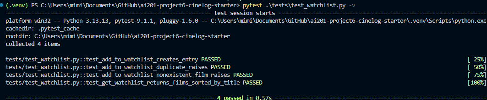
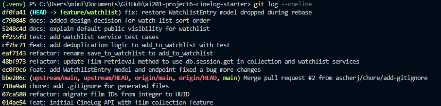

# PR Response Doc — CineLog Watchlist Feature

## AI Usage
<!-- Fill in at the end — how you used AI tools during this project -->

I used Claude AI to summarize files like models.py, walk me through particular functions like add_to_collection(), and ask specific questions that I didn't understand. 

I used AI to create test cases. 

## Comment 1 — Rename
**What I did:** I renamed save_to_watchlist() to add_to_watchlist() in services/watchlist_service.py and updated 2 instances in routes/watchlist/watchlist.py
**How I verified:** I did a project wide search to make sure I didn't miss any. 

## Comment 2 — Deduplication
**What I did:** I added a deduplication logic to add_to_watchlist() using the simialr logic from add_to_collection(). I had to create  a class AlreadyInWatchListError to raise duplicate error appropriate for watch list. 
**How I verified:** I created a test file test_watchlist in tests/ that test following the test_collection pattern and added a test for duplication to make sure it raises the AlreadyInWatchListError exception with the help of Claude. 

## Comment 3 — Missing test
**What I did:** I added the remaining test cases in tests/test_watchlist.py. I sorted watch list by title as people may want to see what movies to watch not
by how recent. Sorting by name makes it easier to navigate the list.

Also, I had to add watchlist_entries = db.relationship("WatchlistEntry", backref="film", lazy=True) to the Film class so watch list model has relationship with film attribute. 
**How I verified:** I ran the tests and it passed all the test. 

## Comment 4 — Default visibility
**My position:** The default visibility for watch list should be true so other can see what people are looking forward to watch. 
**Reasoning:** A watch list is not a Personally Identifiable  Information (PII) where someone else would be able to steal private data from the user and commit identity theft. Having it public will allow others to look at movies they can potentially watch. It's essentially a public respository of movies others find interesting.  
**Tradeoff acknowledged:** Some users may have issues with having their watch list being made public, especially if they didn't pay attention that it's public by default. To counter that we can, show on the UI the list is public.

## Comment 5 — Sort order
**My position:**
**Reasoning:**
**Engagement with reviewer's point:**

## Comment 6 — Rebase
**What conflicted:**
**How I resolved it:**
**How I verified no conflict remains:**

## PR Description
<!-- Written at the end — feature overview, design decisions, manual testing steps -->

## git log
